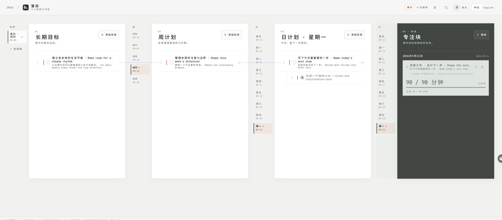
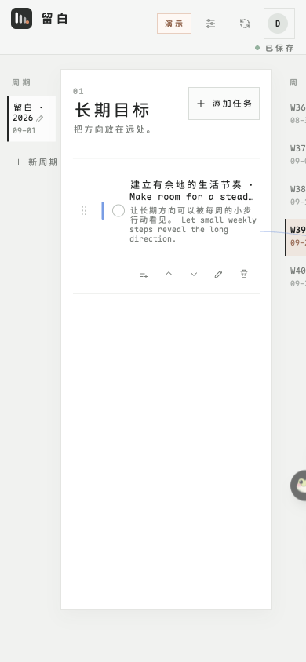

# 留白 · Liubai Taskboard

把长期想做的事，落到这一周、这一天，然后按下计时器。

四列并排：长期目标 → 周计划 → 日计划 → 专注。任务挂在上一层下面，细线把来处和去处连起来。



**在线使用**：https://taskboard-liubai.vercel.app
**不想注册**：点 LOCAL DEMO，演示板只留在你自己的浏览器里。

---

## 没做完的，会跟着你走

上一周没做完的周计划、昨天没做完的日计划，下次打开时会自己顺延到当前周期（周 → 本周，日 → 今天），并在任务上标出来源周期（`W38`、`09-20`）——你一眼就知道它是从哪一周、哪一天漂过来的。

原来那条会留在归档里，不覆盖、不消失，所以「这件事最初排在哪一周」一直查得到。挂在上层的关联也跟着走，不会断线。

## 专注


给一件事留一段不被打断的时间。计时显示还剩多久，可以暂停，也可以提前结束。结束的会记在当天。

## 手机上也是同一块板



## 顺手的地方

- 中文 / English 随时切换，包括保存失败、冲突、离线这些提示
- `←` `→` 换面板，`1`–`4` 直接跳过去，`Esc` 关掉弹窗
- 断网或是两台设备同时改了：不会互相覆盖，能合并的自动合并，真的冲突才让你选

## 自己跑一份

需要 Node 24 与 pnpm：

```bash
pnpm install
cp .env.example .env.local
pnpm dev
```

后端用 Supabase：邮箱密码登录，每个账号只能看到自己的板。`supabase/migrations/` 里的 `001`–`004` 依次执行，再把 `VITE_SUPABASE_URL` 与 publishable key 填进 `.env.local`。

前端是纯静态产物，`pnpm build` 之后把 `dist/` 丢给任意静态托管都行。

界面字体是自托管的 Maple Mono NF CN，不请求任何第三方 CDN。

设计取舍与不变量见 [`docs/SPEC.md`](docs/SPEC.md)。

[MIT](LICENSE)
