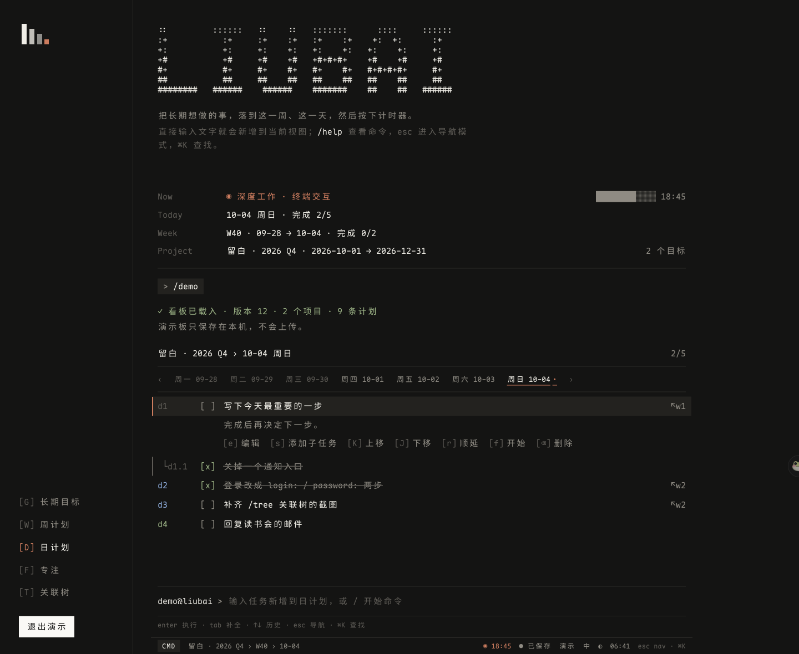
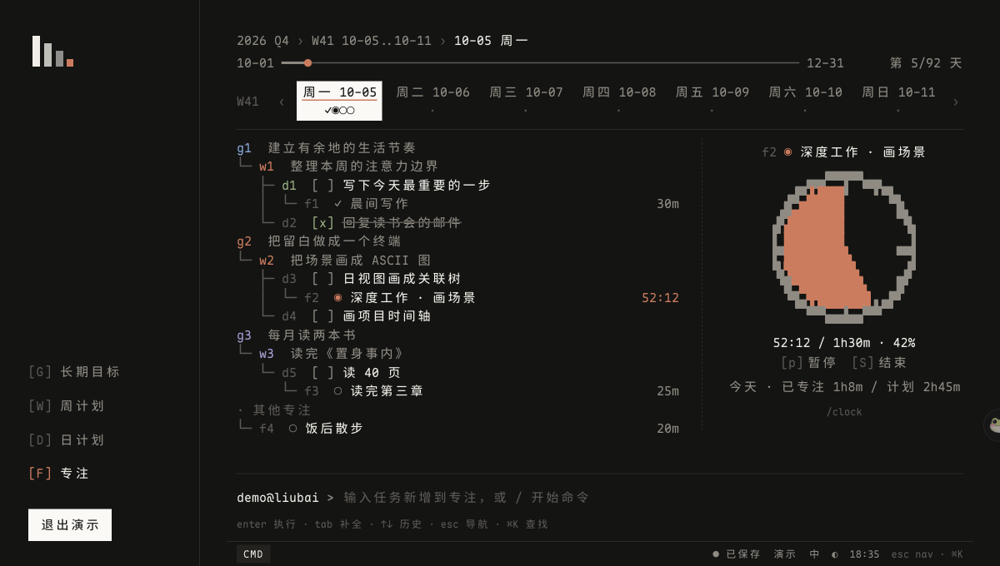
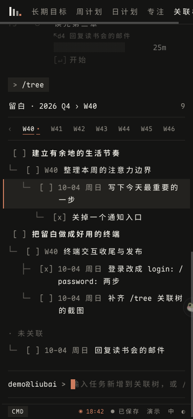

# 留白 · Liubai Taskboard

把长期想做的事，落到这一周、这一天，然后按下计时器。

整个看板就是一个终端：输出往下滚，导航靠提示符。直接打字就是新增，`/` 开头是命令，鼠标点到的地方也都对应一条命令。



**在线使用**：https://taskboard-liubai.vercel.app
**不想注册**：输入 `/demo`，演示板只留在你自己的浏览器里。

---

## 登录也在终端里

```
guest@liubai > /login
login: you@example.com
password:                     ← 和真终端一样，不回显
✓ 欢迎回来，you@example.com
✓ 看板已载入 · 版本 42 · 3 个项目 · 41 条计划
you@liubai > _
```

## 打字就是规划

```
you@liubai > 回复邮件                  + d3 回复邮件
you@liubai > 写周报 #blue ^w1          + d4 写周报        ← 蓝色，挂在本周 w1 下
you@liubai > /done d1 d3               [x] d1 … [x] d3 …
you@liubai > /mv d4 +1                 → d4 写周报 · 明天
you@liubai > /start d2 25              ◉ 25 分钟专注开始
```

行首的 `g1` `w1` `d1` `f1` 是当前视图里的编号，`d1.1` 是子任务。`/goals` `/week` `/day` `/focus` 切视图，`/tree` 把「目标 → 周 → 日」画成一棵树。

## 没做完的，会跟着你走

上一周没做完的周计划、昨天没做完的日计划，下次打开时会自己顺延到当前周期（周 → 本周，日 → 今天），并在行尾标出来源（`←W38`、`←09-20`）——你一眼就知道它是从哪一周、哪一天漂过来的。

原来那条会留在归档里，不覆盖、不消失，所以「这件事最初排在哪一周」一直查得到。挂在上层的关联也跟着走，不会断线。

## 专注



给一件事留一段不被打断的时间：`/start d1` 直接为日计划开一个计时器，进度条和倒计时一直在状态栏里。可以 `/pause`，也可以 `/stop` 提前结束，结束的会记在当天。

## 手机上也是同一个终端



## 顺手的地方

- `/help` 列出全部命令，`↑↓` 选、回车执行；输入 `/` 会自动补全，`↑↓` 翻历史
- `Esc` 进入导航模式：`j/k` 移动、`x` 勾选、`e` 编辑、`J/K` 排序、`g/w/d/f/t` 切视图、`h/l` 翻页
- `⌘K` / `Ctrl+K` 查找任务、项目和视图
- `/theme` 深浅色，`/lang` 中文 / English，包括保存失败、冲突、离线这些提示
- 断网或是两台设备同时改了：不会互相覆盖，能合并的自动合并，真的冲突才让你选（`/retry` `/sync` `/reopen`）

## 自己跑一份

需要 Node 24 与 pnpm：

```bash
pnpm install
cp .env.example .env.local
pnpm dev
```

后端用 Supabase：在终端里 `/login` 邮箱密码登录，每个账号只能看到自己的板。`supabase/migrations/` 里的 `001`–`008` 依次执行，再把 `VITE_SUPABASE_URL` 与 publishable key 填进 `.env.local`。已有部署先补齐迁移，再发布前端。

看板前端可以静态托管；MCP 连接器还需要 `api/` 中的 Node 24 服务端函数，推荐部署完整仓库到 Vercel。

界面字体是自托管的 Maple Mono NF CN，不请求任何第三方 CDN。

设计取舍与不变量见 [`docs/SPEC.md`](docs/SPEC.md)。

## Claude Chat / MCP

在 Claude 连接器中添加 `https://taskboard-liubai.vercel.app/api/mcp`，登录留白后授权自己的看板。支持 MCP 2026-07-28，并兼容 2025-11-25 等旧版客户端；不需要在聊天中提供密码或 API Key。

云端网页与 Agent 共用 30 天回收站和 90 天审计；完整读写、原子批量操作和冲突保护共用现有领域规则。在终端里输入 `/account`（或点侧栏的「连接 Claude」）可撤销授权、恢复数据；永久清除仅允许网页用户操作。

部署与最小验证见 [`docs/MCP.md`](docs/MCP.md)。

[MIT](LICENSE)
